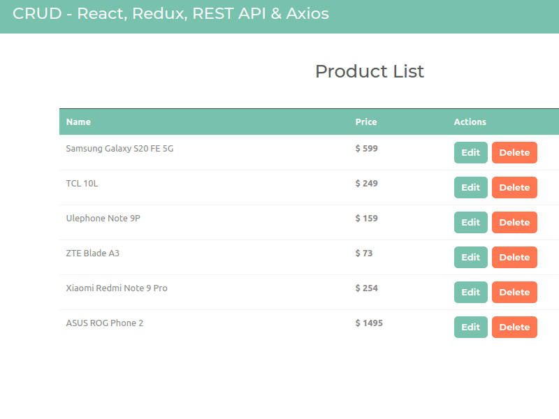

<!-- PROJECT SHIELDS -->
<!--
*** "reference style" links are used for readability.
*** Reference links are enclosed in brackets [ ] instead of parentheses ( ).
*** See the bottom of this document for the declaration of the reference variables
*** for contributors-url, forks-url, etc. This is an optional, concise syntax you may use.
*** https://www.markdownguide.org/basic-syntax/#reference-style-links
-->

[![Contributors][contributors-shield]][contributors-url]
[![Forks][forks-shield]][forks-url]
[![Stargazers][stars-shield]][stars-url]
[![Issues-open][issues-open-shield]][issues-open-url]
[![Issues-closed][issues-closed-shield]][issues-closed-url]

# CRUD - React, Redux, REST API & Axios

> Basic CRUD application using React and Redux

## Features

- React 17
- Redux 4
- Axios
- Use of hooks only
- SweetAlert2
- json-server
- ESLint + Prettier

## Getting Started

- `git clone git@github.com:fabricio-garcia/crud-redux.git`
- `cd crud-redux`
- `npm install`
- `json-server src/db.json -p 4000`
- `npm start`
- visit `http://localhost:3000/`
- visit `http://localhost:4000/` (API)

## Contributing

Contributions, issues and feature requests are welcome!

Feel free to check the [issues page](issues/).

## Acknowledgments

- [Juan Pablo De la torre Valdez](https://www.udemy.com/course/react-de-principiante-a-experto-creando-mas-de-10-aplicaciones/)

## License

This project is [MIT](https://opensource.org/licenses/MIT) licensed.

<!-- MARKDOWN LINKS & IMAGES -->
<!-- https://www.markdownguide.org/basic-syntax/#reference-style-links -->

[contributors-shield]: https://img.shields.io/github/contributors/fabricio-garcia/crud-redux?style=plastic
[contributors-url]: https://github.com/fabricio-garcia/crud-redux/graphs/contributors
[forks-shield]: https://img.shields.io/github/forks/fabricio-garcia/crud-redux?style=plastic
[forks-url]: https://github.com/fabricio-garcia/crud-redux/network/members
[stars-shield]: https://img.shields.io/github/stars/fabricio-garcia/crud-redux?style=plastic
[stars-url]: https://github.com/fabricio-garcia/crud-redux/stargazers
[issues-open-shield]: https://img.shields.io/github/issues/fabricio-garcia/crud-redux?style=plastic
[issues-closed-url]: https://github.com/fabricio-garcia/crud-redux/issues
[issues-closed-shield]: https://img.shields.io/github/issues-closed/fabricio-garcia/crud-redux?style=plastic
[issues-open-url]: https://github.com/fabricio-garcia/crud-redux/issues
